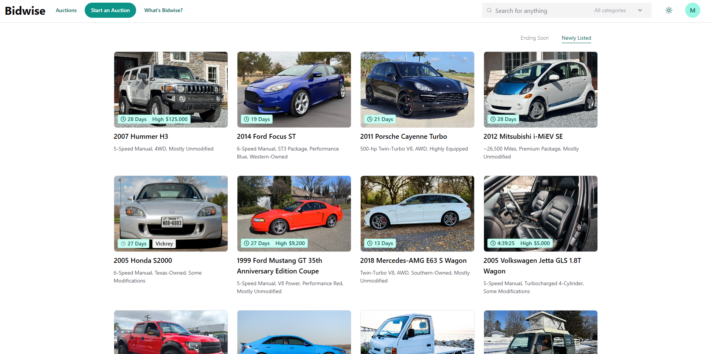

# Bidwise

Bidwise is an online bidding platform that demonstrates how .NET Aspire can be used to orchestrate a full-stack, polyglot system composed of multiple technologies. It brings together microservices built with .NET and Spring Boot, a React frontend with a BFF server, SQL Server for data storage, and Kafka for inter-service communication. 

## Quick Shortcuts

- [Notable features](#-notable-features-include)
- [Functional Requirements](#-functional-requirements)
- [Setup & run](#-setup--run)
- [High Level Architecture](#-high-level-architecture)
- [App Overview](#-app-overview)
    - [Home Page](#-home-page)
    - [Auction Details](#-auction-details)
    - [Profile](#-profile)
    - [My Listings](#-my-listings)
    - [My Bids](#-my-bids)
    - [Aspire Dashboard](#-net-aspire-dashboard)

## # Notable features include:

- [.NET Aspire](https://learn.microsoft.com/en-us/dotnet/aspire/get-started/aspire-overview) for running React, Kafka, Sql Server Databases, and all Microservices
- Security across services with [Duende Identity Server](https://duendesoftware.com/products/identityserver)
- Auction winner determination handled via scheduled [Hangfire](https://www.hangfire.io/) background jobs triggered at the auction end time 
- Real-time updates for bids and comments with [SignalR](https://learn.microsoft.com/en-us/aspnet/core/signalr/introduction?view=aspnetcore-9.0)
- <b>Phonetic search support</b> using the <b>Double Metaphone algorithm</b> (Users can find auction items even with misspellings or similar-sounding words)
- Amazon <b>S3</b> for file storage and <b>CloudFront</b> for CDN
- A ReactJS frontend with a <b>Backend-for-Frontend (BFF)</b> server

## # Functional Requirements:
1.	<b>Personas</b>: The system will be used by Users (Buyers and Sellers) or Guests
	a.	<b>Guests</b>: Browse Auctions, View Details of Auction, View User Profiles
	b.	<b>Users</b>: Browse Auctions, View Details of Auction, View User Profiles, Post an Auction (Sell), Place Bid (Buy), Post Comment, Manage Account, Mange Listed Auctions
2.	<b>Bidding (Buying)</b>: System allows users to bid on products
	a.	Users can bid on product as long as the auction has not ended
3.	<b>Posting Auction (Selling)</b>: System allows users to post an auction
	a.	Users can post an auction with required information along with an auction end time
4.	<b>Commenting</b>: System allows users to comment on products
5.	<b>Winner Selection</b>: For every auction, the system will automatically determine a winner automatically at the users specified auction end time
	a.	The system must choose a winner and set the winning amount based on auction type
	b.	If winner selection fails, the system must retry using an exponential backoff mechanism
6.	<b>User Profiles</b>: System allows everyone to view user profiles
	a.	User profile includes Products (Items) Auctioned and Bid History
7.	<b>Managing Account</b>: System allows users to manage their account
	a.	Change email
	b.	Forgot password, Reset password
	c.	Setup two-factor authentication
	d.	Add phone number

## # Setup & Run:

1. Install prerequisites:
	1. [Docker](https://www.docker.com/)	
	2. [.NET SDK 8.0](https://dotnet.microsoft.com/en-us/download/dotnet/8.0)
	3. [.NET SDK 9.0](https://dotnet.microsoft.com/en-us/download/dotnet/9.0)
	4. [JDK 21](https://learn.microsoft.com/en-us/java/openjdk/download#openjdk-21)
	5. [Apache Maven](https://maven.apache.org/download.cgi)
	6. [Node.js](https://nodejs.org/en)
2. Configure application settings:
	1. Fill `AWS` section in `Bidwise.Catalog` project's `appsettings.json`
    2. Fill `Authentication` and `Mail` sections in `Bidwise.Identity` project's `appsettings.json`
	3. Fill `Parameters` sections in `Bidwise.AppHost` project's `appsettings.json`
3. Start the project:
	1. Launch the `Bidwise.AppHost` project this project is managed by .NET Aspire, which will automatically pull required container images and launch all dependent services and microservices for you

## # High Level Architecture

## # App Overview
> The UI design is inspired by [carsandbids.com](https://carsandbids.com/).

### # Home Page

The homepage displays active auctions, with each card showing the product name, short description, time remaining, current highest bid, and a product photo. The layout is simple for easy browsing by both guests and registered users. 

### # Auction Details

This page displays key information about the auction: the product name, a short description, photos, time left, highest bid, number of bids, and number of comments. 

There is a 'Place Bid' button for users to place their bids. The right side of photos shows the users bids, allowing participants to track bidding activity.

The bottom half displays the seller's note, product attributes, and a comment section. It also includes a list titled 'Auctions Ending Soon', featuring other auctions which are ending soon.

### # Profile

The profile page is accessed by clicking on a username and displays two main sections: Items Auctioned and Bid History. The Items Auctioned section shows the auctions the user has listed, while the Bid History section lists the auctions, they have placed bids on.

The <b>Bid History</b> part of the profile page displays a list of auctions. Each card shows the badges: a clock icon indicates ongoing auction, `Won for $200` signifies a winning bid, and `Bid $30` without a clock indicates a lost auction.

### # My Listings

This page provides users with an overview of their listed products in a clear, table format. The table displays important information for each listing, including the <b>Item</b>, <b>Result</b>, <b>Starting Bid</b>, <b>Current Highest Bid</b>, and <b>Winner</b>. This format allows users to easily manage and track the status of their auctions.

### # My Bids

The <b>My Bids</b> page also allows users to view and manage their bids in a straightforward table format. This page provides users with a clear overview of their bidding activity and the current status of each item they have bid on.

### # .NET Aspire Dashboard

For orchestration, observability and telemetry.

